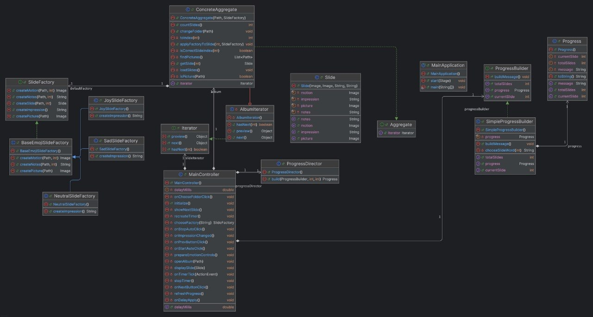
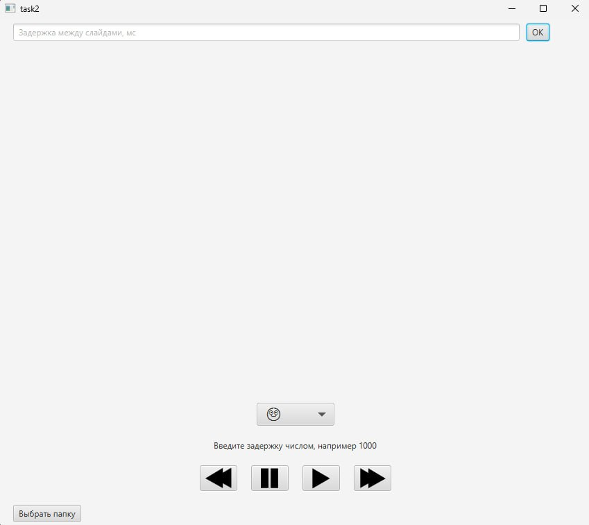
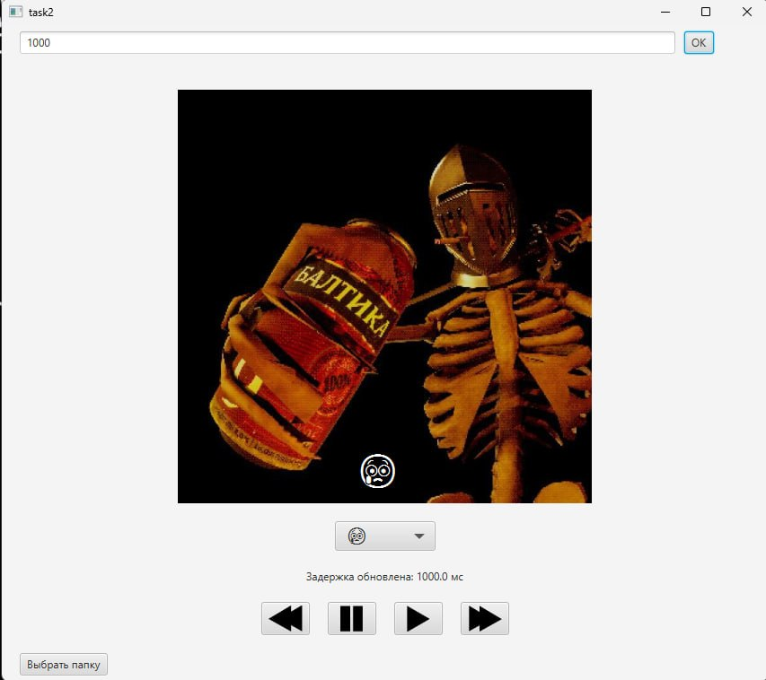

## Кратко о приложении
Разработанное JavaFX‑приложение предоставляет пользователю возможность выбора источника визуального контента: либо загрузка произвольной папки с изображениями с локального диска, либо использование встроенного альбома-примера. После выбора источника запускается автоматическое слайд‑шоу с регулируемой скоростью смены кадров. В процессе просмотра пользователь может фиксировать свои эмоциональные реакции (например, радость, удивление, спокойствие) и добавлять текстовые заметки к любому изображению. Все собранные данные привязываются к конкретному кадру. По завершении сеанса приложение формирует итоговый «альбом впечатлений»: каждое изображение оформляется в единой стилизованной рамке с наложенными заметками и эмоциональными метками, после чего весь альбом экспортируется в отдельную независимую папку, готовую к просмотру или распространению.

## Паттерны
- **Iterator + SlideNavigator** — паттерн `Iterator` реализован через конкретный класс `ConcreteAggregate`, который управляет коллекцией кадров, а `SlideNavigator` выступает в роли итератора, инкапсулирующего логику последовательного перехода по изображениям. Такая связка позволяет листать кадры вперёд и назад без раскрытия внутреннего устройства коллекции, а также повторно инициализировать навигатор после любой загрузки нового источника (папки или встроенного альбома), сохраняя единый интерфейс управления.

- **Builder + Director** — в применении к индикаторам: класс `BuilderIndicator` отвечает за пошаговую конфигурацию внешнего вида, а `Director` управляет процессом сборки, создавая прогресс‑ и таймер‑индикаторы в двух возможных представлениях — линейном (горизонтальная шкала) или круговом (спиннер с заполнением). Это полностью избавляет контроллер от ручного конструирования UI‑узлов, делегируя сложность сборки специализированным классам.

- **Abstract Factory** — интерфейс `AggregateComponentsFactory` определяет создание двух взаимосвязанных объектов: агрегата и навигатора. Его конкретные реализации — `DirectoryAggregateFactory` (для работы с локальной файловой системой) и `EmbeddedAggregateFactory` (для встроенных ресурсов) — скрывают детали получения изображений: первая сканирует указанную папку и фильтрует поддерживаемые форматы, вторая загружает предопределённый набор картинок из classpath. Каждая фабрика возвращает полностью готовую пару «агрегат + навигатор», позволяя остальному коду не зависеть от источника данных.

## Диаграмма

## Открытая программа

